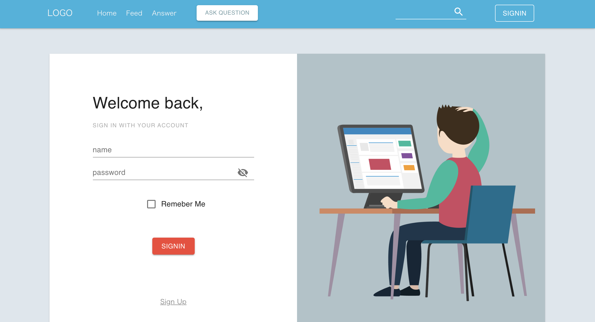
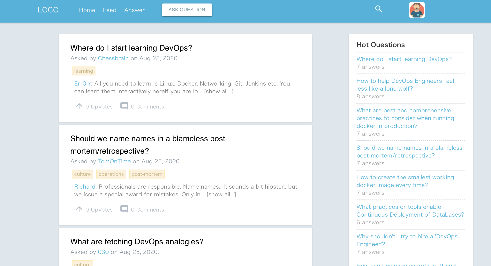
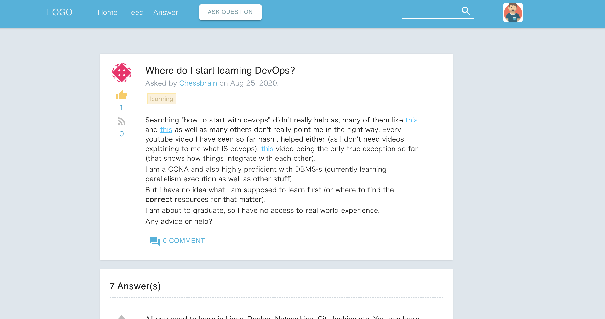
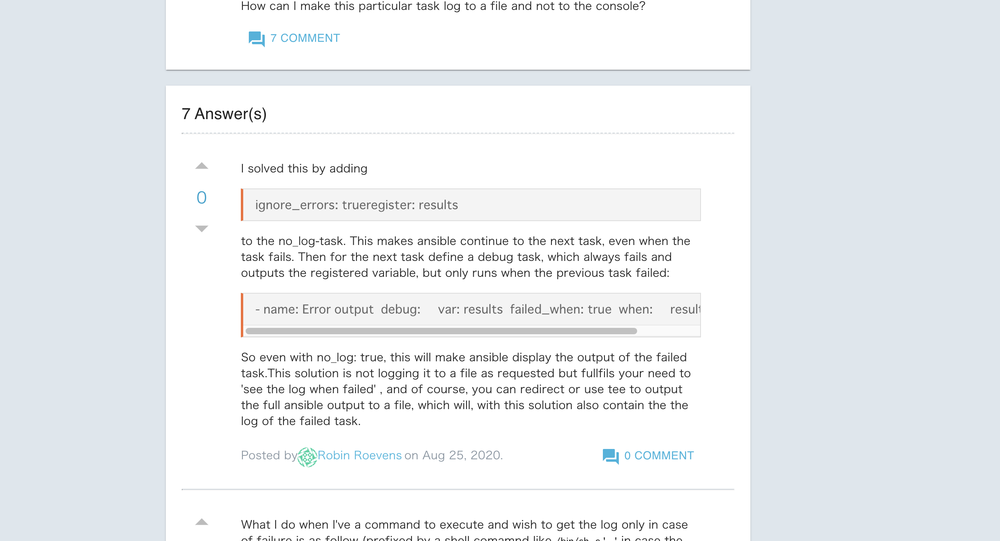
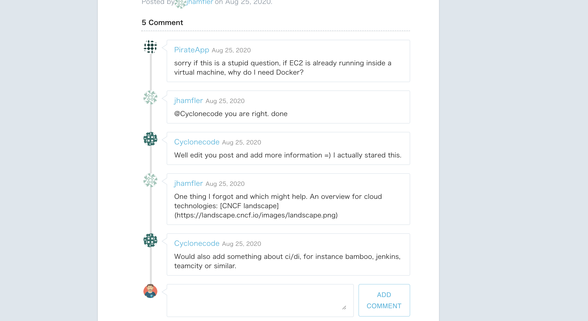
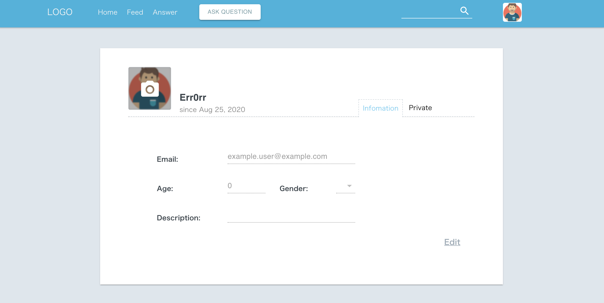
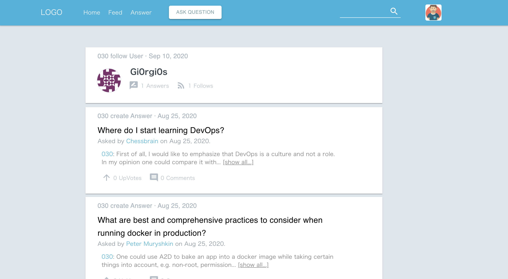
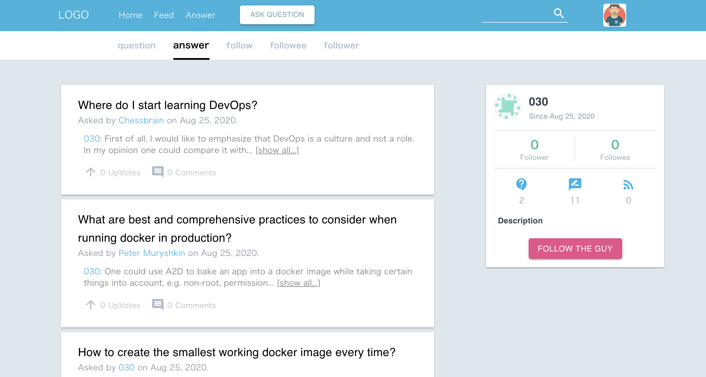
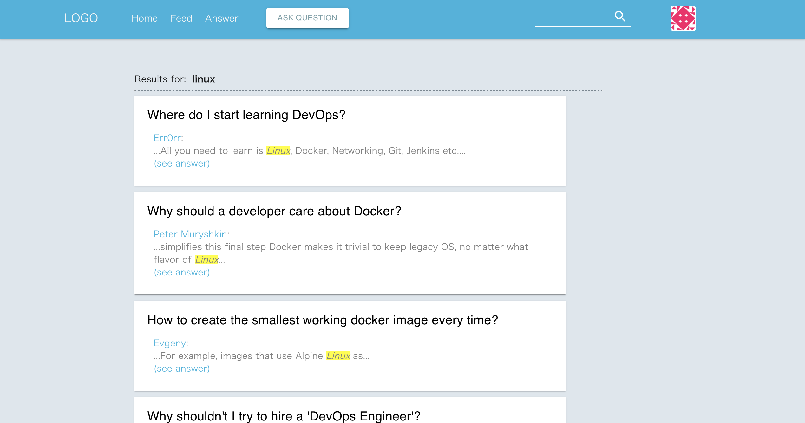

# Smart Post frontend

A question and answer site frontend using react stack. The design is heavily refer to [this deisgn](https://dribbble.com/shots/1869970-Forum-Question-and-Answer-Page-Design) from dribbble.

This project mainly uses

- React stack (react, react-dom, react-route...)
- Redux
- Redux Thunk
- Material UI
- webpack
- axios

# How to run

To run application, check [backend](https://github.com/bin-jump/question-answer).

# Description

This frontend basicly uses the react hooks. The redux part is design to be easily scaled. The component design is not that clean I might adjust in the future.

# UI example

Signin

Home

Question

Answer

Comment

Account (user image can be changed also)

Feed

Profile

Search

